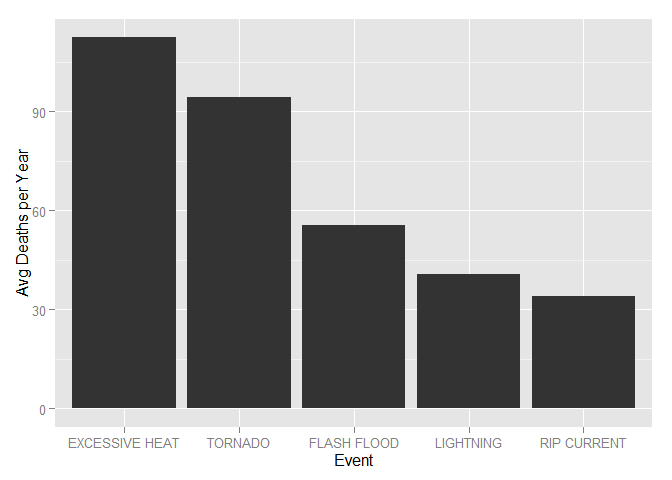

# The Cost of Weather Events in the United States
Kenneth Lee  
October 25, 2015  

## Synopsis

In this analysis, we examined information from the U.S. National Oceanic and Atmospheric Administration's (NOAA) Storm Events Database (from 1996 to 2011) to find the most harmful and most costly weather events.  From these data we found that, on average for each year across the U.S., excessive heat caused the most deaths, tornadoes caused the most injuries, and floods caused the most damage to property and crops.

## Data Processing

From the <a href="http://www.ncdc.noaa.gov/stormevents/">NOAA Severe Weather</a> website we obtained data on storm events across the U.S. gathered by the National Weather Service (NWS) from a variety of sources, which include but are not limited to: county, state, and federal emergency management officials, local law enforcement officials, skywarn spotters, NWS damage surveys, newspaper clipping services, the insurance industry and the general public.  We obtained a <a href="https://d396qusza40orc.cloudfront.net/repdata%2Fdata%2FStormData.csv.bz2">file with data up to 2011</a>.

### Reading in the data

We first read in the data from the raw csv file included in the zip archive.  The data is a comma separated file with missing values coded as blank fields.


```r
library(dplyr)
library(ggplot2)

#check if file already exists in working directory
if(!file.exists("repdata-data-StormData.csv.bz2")) {
    download.file("https://d396qusza40orc.cloudfront.net/repdata%2Fdata%2FStormData.csv.bz2",
                  "repdata-data-StormData.csv.bz2")
}

stormData <- read.csv(bzfile("repdata-data-StormData.csv.bz2"), na.strings="", stringsAsFactors=FALSE)
```

After reading in the file, we check the table (there are 902,297 rows).


```r
str(stormData)
```

```
## 'data.frame':	902297 obs. of  37 variables:
##  $ STATE__   : num  1 1 1 1 1 1 1 1 1 1 ...
##  $ BGN_DATE  : chr  "4/18/1950 0:00:00" "4/18/1950 0:00:00" "2/20/1951 0:00:00" "6/8/1951 0:00:00" ...
##  $ BGN_TIME  : chr  "0130" "0145" "1600" "0900" ...
##  $ TIME_ZONE : chr  "CST" "CST" "CST" "CST" ...
##  $ COUNTY    : num  97 3 57 89 43 77 9 123 125 57 ...
##  $ COUNTYNAME: chr  "MOBILE" "BALDWIN" "FAYETTE" "MADISON" ...
##  $ STATE     : chr  "AL" "AL" "AL" "AL" ...
##  $ EVTYPE    : chr  "TORNADO" "TORNADO" "TORNADO" "TORNADO" ...
##  $ BGN_RANGE : num  0 0 0 0 0 0 0 0 0 0 ...
##  $ BGN_AZI   : chr  NA NA NA NA ...
##  $ BGN_LOCATI: chr  NA NA NA NA ...
##  $ END_DATE  : chr  NA NA NA NA ...
##  $ END_TIME  : chr  NA NA NA NA ...
##  $ COUNTY_END: num  0 0 0 0 0 0 0 0 0 0 ...
##  $ COUNTYENDN: logi  NA NA NA NA NA NA ...
##  $ END_RANGE : num  0 0 0 0 0 0 0 0 0 0 ...
##  $ END_AZI   : chr  NA NA NA NA ...
##  $ END_LOCATI: chr  NA NA NA NA ...
##  $ LENGTH    : num  14 2 0.1 0 0 1.5 1.5 0 3.3 2.3 ...
##  $ WIDTH     : num  100 150 123 100 150 177 33 33 100 100 ...
##  $ F         : int  3 2 2 2 2 2 2 1 3 3 ...
##  $ MAG       : num  0 0 0 0 0 0 0 0 0 0 ...
##  $ FATALITIES: num  0 0 0 0 0 0 0 0 1 0 ...
##  $ INJURIES  : num  15 0 2 2 2 6 1 0 14 0 ...
##  $ PROPDMG   : num  25 2.5 25 2.5 2.5 2.5 2.5 2.5 25 25 ...
##  $ PROPDMGEXP: chr  "K" "K" "K" "K" ...
##  $ CROPDMG   : num  0 0 0 0 0 0 0 0 0 0 ...
##  $ CROPDMGEXP: chr  NA NA NA NA ...
##  $ WFO       : chr  NA NA NA NA ...
##  $ STATEOFFIC: chr  NA NA NA NA ...
##  $ ZONENAMES : chr  NA NA NA NA ...
##  $ LATITUDE  : num  3040 3042 3340 3458 3412 ...
##  $ LONGITUDE : num  8812 8755 8742 8626 8642 ...
##  $ LATITUDE_E: num  3051 0 0 0 0 ...
##  $ LONGITUDE_: num  8806 0 0 0 0 ...
##  $ REMARKS   : chr  NA NA NA NA ...
##  $ REFNUM    : num  1 2 3 4 5 6 7 8 9 10 ...
```

We notice BGN_DATE column contains strings representing date and time.  The times are all 12:00 AM, so we can discard the time and convert the column to Date type.


```r
stormData$BGN_DATE <- strtrim(stormData$BGN_DATE, nchar(stormData$BGN_DATE)-8) #remove time portion of string
stormData$BGN_DATE <- as.Date(stormData$BGN_DATE, format="%m/%d/%Y") #convert string to Date
```

### Subsetting the data

The dataset we loaded starts from 1950-01-03 and ends on 2011-11-30.  As noted by <a href="http://www.ncdc.noaa.gov/stormevents/details.jsp?type=eventtype">NOAA National Climatic Data Center</a>, due to changes in the data collection and processing procedures over time, standardized event types were not implemented until January 1996.  Since we are interested in comparing the destructive nature of storm events in this analysis, we will focus on events that occurred on or after January 1996 and only those events which resulted in fatalities, injuries, property damage, or crop damage.


```r
stormData <- subset(stormData, BGN_DATE >= "1996-01-01") #remove data prior to 1996
stormData <- subset(stormData, !grepl("^[sS]ummary", EVTYPE)) #remove summary rows which will impact (by double counting) our aggregated metrics later
stormData <- subset(stormData, FATALITIES!=0 | INJURIES!=0 | PROPDMG!=0 | CROPDMG!=0) #remove rows with 0 fatalities/injuries/damage
stormData$EVTYPE <- toupper(trimws(stormData$EVTYPE)) #trim whitespace and make all uppercase
```

### Cleaning event types

We examine the EVTYPE (event type) values to check whether they fall within the 48 standard types as specified in <a href="http://www.ncdc.noaa.gov/stormevents/pd01016005curr.pdf">NWS Directive 10-1605</a>.


```r
unique(stormData$EVTYPE)
```

```
##   [1] "WINTER STORM"              "TORNADO"                  
##   [3] "TSTM WIND"                 "HIGH WIND"                
##   [5] "FLASH FLOOD"               "FREEZING RAIN"            
##   [7] "EXTREME COLD"              "LIGHTNING"                
##   [9] "HAIL"                      "FLOOD"                    
##  [11] "TSTM WIND/HAIL"            "EXCESSIVE HEAT"           
##  [13] "RIP CURRENTS"              "OTHER"                    
##  [15] "HEAVY SNOW"                "WILD/FOREST FIRE"         
##  [17] "ICE STORM"                 "BLIZZARD"                 
##  [19] "STORM SURGE"               "ICE JAM FLOOD (MINOR"     
##  [21] "DUST STORM"                "STRONG WIND"              
##  [23] "DUST DEVIL"                "URBAN/SML STREAM FLD"     
##  [25] "FOG"                       "ROUGH SURF"               
##  [27] "HEAVY SURF"                "HEAVY RAIN"               
##  [29] "MARINE ACCIDENT"           "AVALANCHE"                
##  [31] "FREEZE"                    "DRY MICROBURST"           
##  [33] "WINDS"                     "COASTAL STORM"            
##  [35] "EROSION/CSTL FLOOD"        "RIVER FLOODING"           
##  [37] "WATERSPOUT"                "DAMAGING FREEZE"          
##  [39] "HURRICANE"                 "TROPICAL STORM"           
##  [41] "BEACH EROSION"             "HIGH SURF"                
##  [43] "HEAVY RAIN/HIGH SURF"      "UNSEASONABLE COLD"        
##  [45] "EARLY FROST"               "WINTRY MIX"               
##  [47] "DROUGHT"                   "COASTAL FLOODING"         
##  [49] "TORRENTIAL RAINFALL"       "LANDSLUMP"                
##  [51] "HURRICANE EDOUARD"         "TIDAL FLOODING"           
##  [53] "STRONG WINDS"              "EXTREME WINDCHILL"        
##  [55] "GLAZE"                     "EXTENDED COLD"            
##  [57] "WHIRLWIND"                 "HEAVY SNOW SHOWER"        
##  [59] "LIGHT SNOW"                "COASTAL FLOOD"            
##  [61] "MIXED PRECIP"              "COLD"                     
##  [63] "FREEZING SPRAY"            "DOWNBURST"                
##  [65] "MUDSLIDES"                 "MICROBURST"               
##  [67] "MUDSLIDE"                  "SNOW"                     
##  [69] "SNOW SQUALLS"              "WIND DAMAGE"              
##  [71] "LIGHT SNOWFALL"            "FREEZING DRIZZLE"         
##  [73] "GUSTY WIND/RAIN"           "GUSTY WIND/HVY RAIN"      
##  [75] "WIND"                      "COLD TEMPERATURE"         
##  [77] "HEAT WAVE"                 "COLD AND SNOW"            
##  [79] "RAIN/SNOW"                 "TSTM WIND (G45)"          
##  [81] "GUSTY WINDS"               "GUSTY WIND"               
##  [83] "TSTM WIND 40"              "TSTM WIND 45"             
##  [85] "HARD FREEZE"               "TSTM WIND (41)"           
##  [87] "HEAT"                      "RIVER FLOOD"              
##  [89] "TSTM WIND (G40)"           "RIP CURRENT"              
##  [91] "MUD SLIDE"                 "FROST/FREEZE"             
##  [93] "SNOW AND ICE"              "AGRICULTURAL FREEZE"      
##  [95] "WINTER WEATHER"            "SNOW SQUALL"              
##  [97] "ICY ROADS"                 "THUNDERSTORM"             
##  [99] "HYPOTHERMIA/EXPOSURE"      "LAKE EFFECT SNOW"         
## [101] "MIXED PRECIPITATION"       "BLACK ICE"                
## [103] "COASTALSTORM"              "DAM BREAK"                
## [105] "BLOWING SNOW"              "FROST"                    
## [107] "GRADIENT WIND"             "UNSEASONABLY COLD"        
## [109] "TSTM WIND AND LIGHTNING"   "WET MICROBURST"           
## [111] "HEAVY SURF AND WIND"       "FUNNEL CLOUD"             
## [113] "TYPHOON"                   "LANDSLIDES"               
## [115] "HIGH SWELLS"               "HIGH WINDS"               
## [117] "SMALL HAIL"                "UNSEASONAL RAIN"          
## [119] "COASTAL FLOODING/EROSION"  "TSTM WIND  (G45)"         
## [121] "HIGH WIND (G40)"           "TSTM WIND (G35)"          
## [123] "COASTAL EROSION"           "UNSEASONABLY WARM"        
## [125] "SEICHE"                    "COASTAL  FLOODING/EROSION"
## [127] "HYPERTHERMIA/EXPOSURE"     "ROCK SLIDE"               
## [129] "GUSTY WIND/HAIL"           "HEAVY SEAS"               
## [131] "LANDSPOUT"                 "RECORD HEAT"              
## [133] "EXCESSIVE SNOW"            "FLOOD/FLASH/FLOOD"        
## [135] "WIND AND WAVE"             "FLASH FLOOD/FLOOD"        
## [137] "LIGHT FREEZING RAIN"       "ICE ROADS"                
## [139] "HIGH SEAS"                 "RAIN"                     
## [141] "ROUGH SEAS"                "TSTM WIND G45"            
## [143] "NON-SEVERE WIND DAMAGE"    "WARM WEATHER"             
## [145] "THUNDERSTORM WIND (G40)"   "LANDSLIDE"                
## [147] "HIGH WATER"                "LATE SEASON SNOW"         
## [149] "WINTER WEATHER MIX"        "ROGUE WAVE"               
## [151] "FALLING SNOW/ICE"          "NON-TSTM WIND"            
## [153] "NON TSTM WIND"             "BRUSH FIRE"               
## [155] "BLOWING DUST"              "VOLCANIC ASH"             
## [157] "HIGH SURF ADVISORY"        "HAZARDOUS SURF"           
## [159] "WILDFIRE"                  "COLD WEATHER"             
## [161] "ICE ON ROAD"               "DROWNING"                 
## [163] "EXTREME COLD/WIND CHILL"   "MARINE TSTM WIND"         
## [165] "HURRICANE/TYPHOON"         "DENSE FOG"                
## [167] "WINTER WEATHER/MIX"        "ASTRONOMICAL HIGH TIDE"   
## [169] "HEAVY SURF/HIGH SURF"      "TROPICAL DEPRESSION"      
## [171] "LAKE-EFFECT SNOW"          "MARINE HIGH WIND"         
## [173] "THUNDERSTORM WIND"         "TSUNAMI"                  
## [175] "STORM SURGE/TIDE"          "COLD/WIND CHILL"          
## [177] "LAKESHORE FLOOD"           "MARINE THUNDERSTORM WIND" 
## [179] "MARINE STRONG WIND"        "ASTRONOMICAL LOW TIDE"    
## [181] "DENSE SMOKE"               "MARINE HAIL"              
## [183] "FREEZING FOG"
```

We find there are over 130 values which are non-standard.  We create a file with a list of the <a href="https://github.com/m00shu/RepData_PeerAssessment2/blob/bfa6cb8769fd9c44fdbec50dd791a8da30c189ef/event_type_std.csv">48 standard event types</a>.  We create another file to <a href="https://github.com/m00shu/RepData_PeerAssessment2/blob/bfa6cb8769fd9c44fdbec50dd791a8da30c189ef/event_type_nonstd.csv">map the non-standard values to standard values</a>.  Using thes files, we add a new column EVTYPESTD (event type standard) to our table and map event types to standard event types.


```r
#download event type mapping files from github repo
if(!file.exists("event_type_std.csv")) {
    download.file("https://github.com/m00shu/RepData_PeerAssessment2/blob/bfa6cb8769fd9c44fdbec50dd791a8da30c189ef/event_type_std.csv",
                  "event_type_std.csv")
}
if(!file.exists("event_type_nonstd.csv")) {
    download.file("https://github.com/m00shu/RepData_PeerAssessment2/blob/bfa6cb8769fd9c44fdbec50dd791a8da30c189ef/event_type_nonstd.csv",
                  "event_type_nonstd.csv")
}

eventTypeStd <- read.csv("event_type_std.csv") #read file containing 48 standard event types
eventTypeStd$EVTYPE <- toupper(eventTypeStd$EVTYPE) #make all uppercase
eventTypeStd$EVTYPESTD <- eventTypeStd$EVTYPE #add duplicate column

eventTypeNonStd <- read.csv("event_type_nonstd.csv") #read file containing non-standard event types
eventTypeNonStd$EVTYPE <- toupper(eventTypeNonStd$EVTYPE) #make all uppercase
eventTypeNonStd$EVTYPESTD <- toupper(eventTypeNonStd$EVTYPESTD) #make all uppercase

eventTypeMap <- rbind(eventTypeStd, eventTypeNonStd) #create combined event map table
rm(eventTypeStd, eventTypeNonStd) #remove objects no longer needed

stormData <- left_join(stormData, eventTypeMap, by=c("EVTYPE")) #add EVTYPESTD to table
```

After mapping, we find there are 3 remaining event types which require closer examination.  Examples for "DAM BREAK" are shown.


```r
table(subset(stormData, is.na(EVTYPESTD))$EVTYPE)
```

```
## 
## DAM BREAK     OTHER      RAIN 
##         2        34         3
```

```r
stormData %>% filter(EVTYPE=="DAM BREAK") %>% select(BGN_DATE, REMARKS)
```

```
##     BGN_DATE
## 1 1997-05-04
## 2 2000-07-17
##                                                                                                                                                                                                                                                                                                                                                                                                                                                                                                                                                                 REMARKS
## 1                                                                                                                                                                                                                                                                                                                                                                               A small dam on a 3 acre lake broke following several heavy rain episodes. Flooding was not severe but caused some damage to roads and resulted in the loss of a large number of fish.\n
## 2 A dam on Tibbetts Pond failed from the combined effects of beavers blocking the outlet pipe and 3 to 5 inches of rain.  The dam, 100 ft long, 6 ft high, and 30 ft wide at the base, failed at about 3 am, causing water to flood Route 16.  A car driven on Route 16 by a 32-year-old man was swept away by the 8-ft wall of water which accompanied the flash flood; fortunately the man survived.  A 900 ft section of Route 16 was washed away by the flood waters; the water cut channels as deep as 20 ft.  Damage was estimated at about 1 million dollars.
```

After reading the remarks, update the remaining non-standard events to standard events.


```r
stormData$EVTYPESTD[stormData$EVTYPE=="DAM BREAK" & stormData$BGN_DATE=="1997-05-04"] <- "HEAVY RAIN"
stormData$EVTYPESTD[stormData$EVTYPE=="DAM BREAK" & stormData$BGN_DATE=="2000-07-17"] <- "FLASH FLOOD"
stormData$EVTYPESTD[stormData$EVTYPE=="OTHER" & stormData$BGN_DATE=="1997-09-02"] <- "DUST DEVIL"
stormData$EVTYPESTD[stormData$EVTYPE=="OTHER" & stormData$BGN_DATE=="2000-09-07"] <- "DUST DEVIL"
stormData$EVTYPESTD[stormData$EVTYPE=="OTHER" & stormData$BGN_DATE=="2001-07-15"] <- "DUST DEVIL"
stormData$EVTYPESTD[stormData$EVTYPE=="OTHER" & stormData$BGN_DATE=="1996-02-03"] <- "HEAVY SNOW"
stormData$EVTYPESTD[stormData$EVTYPE=="OTHER" & stormData$BGN_DATE=="1997-05-01"] <- "HEAVY RAIN"
stormData$EVTYPESTD[stormData$EVTYPE=="RAIN" & stormData$BGN_DATE=="2000-02-23"] <- "HEAVY SNOW"
stormData$EVTYPESTD[stormData$EVTYPE=="RAIN" & stormData$BGN_DATE=="2000-09-01"] <- "HEAVY RAIN"
stormData$EVTYPESTD[stormData$EVTYPE=="RAIN" & stormData$BGN_DATE=="2000-12-16"] <- "SLEET"
```

Check no unmapped events remain.


```r
anyNA(stormData$EVTYPESTD)
```

```
## [1] FALSE
```

Lastly, rename "ASTRONOMICAL LOW TIDE" to "ASTRONOMICAL HIGH/LOW TIDE".  The 48 standard event types include "ASTRONOMICAL LOW TIDE" but there is no corresponding "ASTRONOMICAL HIGH TIDE" despite data to support having such an event.


```r
stormData %>% filter(grepl("^ASTRONOMICAL", EVTYPE)) %>% select(BGN_DATE, EVTYPE, EVTYPESTD)
```

```
##      BGN_DATE                 EVTYPE             EVTYPESTD
## 1  2003-02-17 ASTRONOMICAL HIGH TIDE ASTRONOMICAL LOW TIDE
## 2  2003-02-17 ASTRONOMICAL HIGH TIDE ASTRONOMICAL LOW TIDE
## 3  2003-01-02 ASTRONOMICAL HIGH TIDE ASTRONOMICAL LOW TIDE
## 4  2004-09-06 ASTRONOMICAL HIGH TIDE ASTRONOMICAL LOW TIDE
## 5  2005-01-08 ASTRONOMICAL HIGH TIDE ASTRONOMICAL LOW TIDE
## 6  2005-01-08 ASTRONOMICAL HIGH TIDE ASTRONOMICAL LOW TIDE
## 7  2005-01-09 ASTRONOMICAL HIGH TIDE ASTRONOMICAL LOW TIDE
## 8  2005-01-11 ASTRONOMICAL HIGH TIDE ASTRONOMICAL LOW TIDE
## 9  2007-12-22  ASTRONOMICAL LOW TIDE ASTRONOMICAL LOW TIDE
## 10 2008-06-10  ASTRONOMICAL LOW TIDE ASTRONOMICAL LOW TIDE
```

```r
stormData$EVTYPESTD[stormData$EVTYPESTD=="ASTRONOMICAL LOW TIDE"] <- "ASTRONOMICAL HIGH/LOW TIDE"
```

### Inflation adjustment

This analysis spans 15 years of data.  To put the damage estimates in terms of 2015 dollars, we adjust the numbers for inflation using the <a href="https://en.wikipedia.org/wiki/Consumer_price_index">Consumer Price Index (CPI)</a> provided by the <a href="http://data.bls.gov/cgi-bin/surveymost?bls">Bureau of Labor Statistics</a>.  Specifically, we use <a href="https://en.wikipedia.org/wiki/Core_inflation">core inflation</a> which excludes energy and food products which have volatile prices.


```r
#load core_cpi file from github repo
if(!file.exists("core_cpi.csv")) {
    download.file("https://github.com/m00shu/RepData_PeerAssessment2/blob/bfa6cb8769fd9c44fdbec50dd791a8da30c189ef/core_cpi.csv",
                  "core_cpi.csv")
}
coreCPI <- read.csv("core_cpi.csv", stringsAsFactors=FALSE, skip=10)
coreCPI$Date <- as.Date(coreCPI$Date, format="%m/%d/%Y") #convert string to Date

head(coreCPI)
```

```
##         Date Price
## 1 1996-01-01 163.4
## 2 1996-02-01 164.2
## 3 1996-03-01 164.9
## 4 1996-04-01 165.0
## 5 1996-05-01 165.1
## 6 1996-06-01 165.2
```

Join CPI data with main table.


```r
coreCPI$Date <- format(coreCPI$Date, "%Y-%m") #convert to yyyy-mm string
colnames(coreCPI) <- c("YM", "INFL_FACTOR")
stormData$YM <- format(stormData$BGN_DATE, "%Y-%m") #add column for yyyy-mm string
stormData <- left_join(stormData, coreCPI, by=c("YM"))
```

Apply multipliers on damage estimates.


```r
stormData$PROPDMG[stormData$PROPDMGEXP=="K" & !is.na(stormData$PROPDMGEXP)] <- stormData$PROPDMG[stormData$PROPDMGEXP=="K" & !is.na(stormData$PROPDMGEXP)] * 1000
stormData$PROPDMG[stormData$PROPDMGEXP=="M" & !is.na(stormData$PROPDMGEXP)] <- stormData$PROPDMG[stormData$PROPDMGEXP=="M" & !is.na(stormData$PROPDMGEXP)] * 1000000
stormData$PROPDMG[stormData$PROPDMGEXP=="B" & !is.na(stormData$PROPDMGEXP)] <- stormData$PROPDMG[stormData$PROPDMGEXP=="B" & !is.na(stormData$PROPDMGEXP)] * 1000000000
stormData$CROPDMG[stormData$CROPDMGEXP=="K" & !is.na(stormData$CROPDMGEXP)] <- stormData$CROPDMG[stormData$CROPDMGEXP=="K" & !is.na(stormData$CROPDMGEXP)] * 1000
stormData$CROPDMG[stormData$CROPDMGEXP=="M" & !is.na(stormData$CROPDMGEXP)] <- stormData$CROPDMG[stormData$CROPDMGEXP=="M" & !is.na(stormData$CROPDMGEXP)] * 1000000
stormData$CROPDMG[stormData$CROPDMGEXP=="B" & !is.na(stormData$CROPDMGEXP)] <- stormData$CROPDMG[stormData$CROPDMGEXP=="B" & !is.na(stormData$CROPDMGEXP)] * 1000000000
```

Sum property damage and crop damage.


```r
stormData$DMGNOM <- 0.0 #add column for total damage (nominal, not adjusted for inflation)
stormData$DMGNOM <- stormData$PROPDMG + stormData$CROPDMG
```

Apply inflation adjustment and convert numbers to represent millions.


```r
stormData$DMGREAL <- stormData$DMGNOM * coreCPI$INFL_FACTOR[coreCPI$YM=="2015-09"] / stormData$INFL_FACTOR
stormData$DMGREAL <- stormData$DMGREAL / 1000000 #convert to millions
```

### Impute data for December 2011

In the results of this analysis, we will look at average fatalities, injuries, and damage per event type per year.  However, for the year 2011, we only have data for the first 11 months.  Rather than exclude 2011 data entirely, we will impute data for December 2011 using December averages from previous years.


```r
stormDataDec <- stormData %>% filter(format(BGN_DATE,"%m")=="12") %>% 
    select(EVTYPESTD,FATALITIES,INJURIES,DMGREAL) %>% group_by(EVTYPESTD) %>%
    summarize(FATALITIES=mean(FATALITIES), INJURIES=mean(INJURIES), DMGREAL=mean(DMGREAL))

head(stormDataDec)
```

```
## Source: local data frame [6 x 4]
## 
##                    EVTYPESTD FATALITIES   INJURIES      DMGREAL
##                        (chr)      (dbl)      (dbl)        (dbl)
## 1 ASTRONOMICAL HIGH/LOW TIDE  0.0000000 0.00000000 0.1375194485
## 2                  AVALANCHE  0.9230769 0.59615385 0.0006528568
## 3                   BLIZZARD  0.1914894 0.25531915 0.2731506240
## 4              COASTAL FLOOD  0.0000000 0.05263158 1.9990875679
## 5            COLD/WIND CHILL  1.3666667 0.00000000 0.0232035660
## 6                DEBRIS FLOW  0.5172414 0.37931034 3.4539386063
```

Integrate into main table.


```r
stormDataDec$BGN_DATE <- as.Date("12/1/2011", format="%m/%d/%Y") #1st of the month is arbitrary
stormDataDec$YM <- format(stormDataDec$BGN_DATE, "%Y-%m")

stormDataDec <- stormDataDec %>% select(BGN_DATE, YM, EVTYPESTD, FATALITIES, INJURIES, DMGREAL) #reorder columns
stormData <- stormData %>% select(BGN_DATE, YM, EVTYPESTD, FATALITIES, INJURIES, DMGREAL) #remove columns irrelevant to analysis/results

stormData <- rbind(stormData, stormDataDec) #combine data
rm(stormDataDec) #remove object no longer needed
```

### Aggregation

Now with 15 full years of data, we sum fatalities, injuries, and damage by event type for each year.


```r
stormDataByYear <- stormData %>% group_by(YEAR=format(BGN_DATE,"%Y"), EVTYPESTD) %>% 
    summarize(FATALITIES=sum(FATALITIES), INJURIES=sum(INJURIES), DMGREAL=sum(DMGREAL))

head(stormDataByYear)
```

```
## Source: local data frame [6 x 5]
## Groups: YEAR [1]
## 
##    YEAR       EVTYPESTD FATALITIES INJURIES    DMGREAL
##   (chr)           (chr)      (dbl)    (dbl)      (dbl)
## 1  1996       AVALANCHE          5        5  0.0000000
## 2  1996        BLIZZARD         23      170 60.6866845
## 3  1996   COASTAL FLOOD          2        1 81.2276925
## 4  1996 COLD/WIND CHILL          5        0  7.5174494
## 5  1996     DEBRIS FLOW          1        2  0.8406947
## 6  1996       DENSE FOG          2       42  1.5239335
```

Then take the average per year, keeping the top 5 for fatalities, injuries, and damage.


```r
fatalAvg <- stormDataByYear %>% select(EVTYPESTD, FATALITIES) %>% group_by(EVTYPESTD) %>% 
    summarize(FATALITIES=mean(FATALITIES)) %>% arrange(desc(FATALITIES)) %>% top_n(5)
injuryAvg <- stormDataByYear %>% select(EVTYPESTD, INJURIES) %>% group_by(EVTYPESTD) %>% 
    summarize(INJURIES=mean(INJURIES)) %>% arrange(desc(INJURIES)) %>% top_n(5)
dmgAvg <- stormDataByYear %>% select(EVTYPESTD, DMGREAL) %>% group_by(EVTYPESTD) %>% 
    summarize(DMGREAL=mean(DMGREAL)) %>% arrange(desc(DMGREAL)) %>% top_n(5)

head(fatalAvg)
```

```
## Source: local data frame [5 x 2]
## 
##        EVTYPESTD FATALITIES
##            (chr)      (dbl)
## 1 EXCESSIVE HEAT  112.43750
## 2        TORNADO   94.44344
## 3    FLASH FLOOD   55.43935
## 4      LIGHTNING   40.69034
## 5    RIP CURRENT   33.92188
```

Convert EVTYPESTD column to factor.  This is needed to order x-axis of plots later.


```r
fatalAvg$EVTYPESTD <- factor(fatalAvg$EVTYPESTD, levels=fatalAvg$EVTYPESTD)
injuryAvg$EVTYPESTD <- factor(injuryAvg$EVTYPESTD, levels=injuryAvg$EVTYPESTD)
dmgAvg$EVTYPESTD <- factor(dmgAvg$EVTYPESTD, levels=dmgAvg$EVTYPESTD)
```

## Results

### Fatalities

Taking a look at the average number of fatalities each year, we see that excessive heat is the deadliest with 112 deaths per year on average.  Tornadoes are a close second with 94 deaths and flash floods are a distant third with 55 deaths per year on average.


```r
qplot(x=fatalAvg$EVTYPESTD, y=fatalAvg$FATALITIES, geom="bar", stat="identity",
      xlab="Event", ylab="Avg Deaths per Year")
```

 

### Injuries

In terms of injuries, tornadoes are far and away the most dangerous with 1,291 injuries per year on average.  Floods are in second place with 427 injuries.


```r
qplot(x=injuryAvg$EVTYPESTD, y=injuryAvg$INJURIES, geom="bar", stat="identity",
      xlab="Event", ylab="Avg Injuries per Year")
```

 

### Damage

Turning to the economic impact of storm events, floods are number one, causing on average $11.26 billion of damage per year.  Hurricanes are second, causing on average $7.71 billion of damage per year.  Interestingly, the top three events are all water-based.


```r
qplot(x=dmgAvg$EVTYPESTD, y=dmgAvg$DMGREAL, geom="bar", stat="identity",
      xlab="Event", ylab="Avg Cost of Damage per Year ($ millions)")
```

 

In summary, excessive heat is the most deadly, tornadoes are the most dangerous, and floods are the most damaging to property and crops each year in the United States on average.
